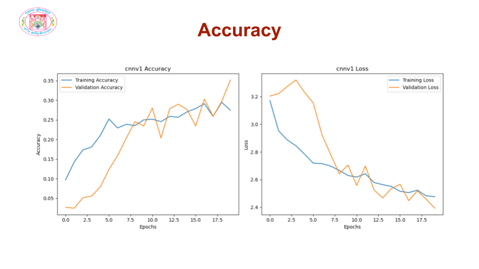

# Visual Insight Assistant
## Host Link : https://visual-insight-assistant.streamlit.app/
## Introduction  

Many people face challenges in recognizing food items, especially those who are visually impaired. Additionally, not knowing the nutritional value of the food we eat can make it harder to make healthy choices. Some foods might also pose health risks if we are unaware of their effects.  

This project aims to address these issues by developing a system that can identify food items from images. Once the food is identified, the system will provide useful insights, such as nutritional information and dietary recommendations.


<p align="center">
  
</p>

## Git Clone and Run the App

1. **Clone the Repository**

2. **Install Dependencies**

    ```
    pip install -r requirements.txt
    ```


3. **Run the App**

    ```
    streamlit run main.py
    ```
## Features  

1. **Food Classification**  
2. **Calories & Protein Level**  
3. **Suggestions**  
4. **Health Alerts**
   
## Dataset  

1. **Image Collection**  
   - Collected **117 images**, which were expanded to **553 images** after cropping.   
   - Added **150-200 similar images** for each category to improve diversity and robustness of the dataset.  

2. **Nutrition Data**  
   - Collected detailed nutritional information for each category, including:  
     1. **Calories**  
     2. **Protein Content**  
     3. **Dietary Suggestions**
  
## Preprocessing  

1. **Image Resizing**  
   - Resized all images to a fixed size to ensure uniformity and compatibility with the model.  

2. **Data Augmentation**  
   - Applied augmentation techniques during the training process to improve model generalization:  
     - **Cropping**  
     - **Flipping**  
     - **Rotation**  
     - **Scaling**  

3. **Normalization**  
   - Normalized pixel values to a range of **0 to 1** for consistent input to the model.
  
## Model  

The food classification system was built using a **scratch-designed Convolutional Neural Network (CNN)**. This custom model was designed and implemented from the ground up to effectively process and classify image data. By stacking convolutional, pooling, and fully connected layers, the model learns spatial and feature hierarchies from the input images.  

The scratch-built CNN was trained on the preprocessed dataset and optimized for accurate classification of food items for each categories.

### CNN version 1
<p align="center">
  
</p>
<p align="center">
  
</p>

### CNN version 2

<p align="center">
  
</p>
<p align="center">
  
</p>

### CNN version 3

<p align="center">
  
</p>
<p align="center">
  
</p>

### CNN version 4

<p align="center">
  
</p>
<p align="center">
  
</p>

## Result

<p align="center">
  
</p>

- **CNNv1 and CNNv3**:
  - Training accuracy: 27% (CNNv1) and 40% (CNNv3).
  - Performance: Lower compared to other models.

- **CNNv2**:
  - Training accuracy: 55%.
  - Validation accuracy: 55%.
  - Simpler architecture but competitive performance.
  - Identified as a promising candidate for further optimization.

- **CNNv4**:
  - Training accuracy: 72%.
  - Validation accuracy: 66%.
  - Showed improvement over CNNv2.
  - Performance gap with CNNv2 smaller than expected, suggesting CNNv2 could be further optimized.

- **Inception V3 (Pre-trained Model)**:
  - Training accuracy: 92.44%.
  - Validation accuracy: 92.37%.
  - Best-performing model with remarkable accuracy.
  - Outperformed all custom CNN models.


